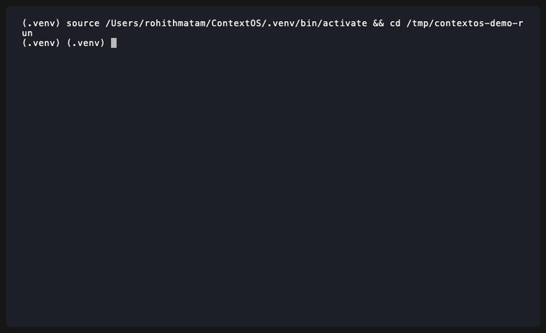

# ContextOS

[](https://github.com/Rohithmatham12/ContextOS/actions/workflows/ci.yml)
[](https://pypi.org/project/rm-contextos/)
[](https://www.python.org/downloads/)
[](LICENSE)

**A context operating system for AI coding agents.**

ContextOS sits between your repository and your AI agent. It scans your code, understands what matters for your current task, enforces a token budget, redacts secrets, and exports a clean context pack in the format your tool expects.

```
your repo  ──►  contextos pack --task "fix auth bug" --budget 8000  ──►  CLAUDE_CONTEXT.md
```

No LLM calls. No network. No token waste.



---

## Demo — Real Repo (FastAPI)

Running ContextOS against the [FastAPI](https://github.com/fastapi/fastapi) source:

```
$ contextos init
$ contextos scan

Scanning /fastapi …

Files indexed : 2,811
Files skipped : 194
Token estimate : ~5,066,968

  Language breakdown
┏━━━━━━━━━━━━┳━━━━━━━┓
┃ Language   ┃ Files ┃
┡━━━━━━━━━━━━╇━━━━━━━┩
│ Markdown   │  1563 │
│ Python     │  1129 │
│ YAML       │    43 │
│ Shell      │     5 │
└────────────┴───────┘

$ contextos pack . \
    --task "fix dependency injection bug where nested dependencies are resolved twice" \
    --budget 8000

Packing /fastapi
  Task         : fix dependency injection bug where nested dependencies are resolved twice
  Budget       : 8,000 tokens
  Format       : md
  ⚠  141 secret(s) detected and redacted with [REDACTED_*]
  Context files: ~7,998 tokens  (budget: 8,000)
  Pack total   : ~65,151 tokens (incl. metadata)
  Selected     : 191 files  (2,620 excluded)

✓ Pack written to .contextos/context_pack.md
```

Top-ranked files in the output (keyword + import-centrality scoring):

| File | Score | Reason |
|------|-------|--------|
| `fastapi/dependencies/utils.py` | 31.2 | keyword: dependencies, inject; 28 dependents |
| `fastapi/__init__.py` | 25.4 | import centrality: 31 files depend on it |
| `tests/test_dependency_duplicates.py` | 18.9 | keyword: dependency, duplicate |
| `fastapi/routing.py` | 14.1 | keyword: inject; 12 dependents |

**141 secrets auto-redacted** — FastAPI's docs contain many example JWT tokens and API keys. All were replaced with `[REDACTED_*]` before the pack was written.

---

## Why ContextOS

AI coding agents are only as good as the context they receive. Three common failure modes:

| Problem | What happens | Cost |
|---------|-------------|------|
| **Dump the whole repo** | Agent sees 200 files, most irrelevant | Wastes tokens, hits context limits |
| **Manual copy-paste** | Developer picks files by hand | Slow, misses dependencies |
| **Let the agent search** | Agent spends turns reading the wrong files | Slow, error-prone |

ContextOS solves this by selecting context automatically — ranking files by relevance to your task, honouring a token budget, surfacing import dependencies, and writing output in the right format for each tool.

---

## ContextOS vs Headroom

These tools are **complementary**, not competing.

| | ContextOS | Headroom |
|--|-----------|----------|
| **What it does** | Selects the right files from your repo | Compresses text that's already selected |
| **Input** | A repository | A block of text |
| **Output** | A focused context pack | The same text, shorter |
| **When to use** | Always — pick what goes in | Optionally — shrink what you picked |

Run them together:

```bash
contextos pack . --task "fix auth" --budget 8000 --compress headroom
```

ContextOS selects; Headroom compresses. The agent receives maximum signal per token.

---

## Quickstart

```bash
pip install rm-contextos
```

```bash
cd my-project

# 1. Initialize the .contextos/ directory
contextos init

# 2. Scan the repo (builds file index + dependency graph)
contextos scan

# 3. Set the active task
contextos task "fix auth bug — token expiry not validated on refresh"

# 4. Pack context for your budget
contextos pack . --task "fix auth bug" --budget 8000

# 5. Export for your tool
contextos export claude --task "fix auth bug"
```

Load into Claude Code:

```
/add .contextos/CLAUDE_CONTEXT.md
```

---

## CLI Reference

### `contextos init [directory]`

Creates `.contextos/` with template files. Safe to run repeatedly — existing files are skipped.

```bash
contextos init                  # current directory
contextos init ./my-project     # specific path
contextos init --force          # reset all files to templates
```

**Creates:**
```
.contextos/
├── CURRENT_TASK.md     active task description
├── MEMORY.md           persistent notes (append-only)
├── DECISIONS.md        architectural decision log (append-only)
└── PROJECT_INDEX.md    repo overview (editable)
```

---

### `contextos scan [repo]`

Walks the repo, classifies files by language, extracts import relationships, and writes a file index.

```bash
contextos scan                  # current directory
contextos scan ./my-project
contextos scan --no-index       # print stats only, no output files
```

**Writes:**
```
.contextos/
├── file_summaries.json         per-file token estimates and metadata
├── dependency_graph.json       import graph
└── PROJECT_INDEX.md            auto-generated project overview
```

**Sample output:**
```
Scanning /home/user/my-project …

Files indexed : 42
Files skipped : 3
Token estimate : ~18,400

┌─ Language breakdown ─────────────────┐
│ Language    │ Files                  │
│─────────────│────────────────────────│
│ python      │ 28                     │
│ markdown    │ 8                      │
│ json        │ 4                      │
│ yaml        │ 2                      │
└─────────────────────────────────────┘

✓ Written to /home/user/my-project/.contextos
```

---

### `contextos task [description|show|clear]`

Sets or displays the active task in `.contextos/CURRENT_TASK.md`.

```bash
contextos task "add rate limiting to the API"   # set task
contextos task show                              # display current task
contextos task clear                             # reset to blank template
```

---

### `contextos pack [repo]`

Selects the most relevant files for the current task within the token budget, and writes a context pack.

```bash
contextos pack . --task "fix auth bug" --budget 8000
contextos pack . --task "refactor DB" --budget 4000 --no-source
contextos pack . --task "add tests"   --budget 16000 --no-tests
contextos pack . --task "fix auth"    --budget 8000  --format json
contextos pack . --task "fix auth"    --budget 8000  --compress headroom
```

| Option | Default | Description |
|--------|---------|-------------|
| `--task` | required | Task description for relevance ranking |
| `--budget` | `8000` | Token budget |
| `--format` | `md` | Output format: `md`, `json` |
| `--no-source` | off | Summaries only; no source code embedded |
| `--no-tests` | off | Exclude test files from selection |
| `--no-timestamp` | off | Omit timestamp (reproducible output) |
| `--compress headroom` | off | Apply Headroom compression after selection |
| `--allow-sensitive` | off | **[DANGEROUS]** Disable secret redaction |
| `--out <path>` | off | Also write output to this path |

**Sample output:**
```
Packing /home/user/my-project
  Task         : fix auth bug
  Budget       : 8,000 tokens
  Format       : md

  Tokens (pack): ~5,840
  Selected     : 4 files  (38 excluded)

✓ Pack written to .contextos/context_pack.md
```

---

### `contextos export <tool>`

Generates a tool-specific context file from your repo and active task.

```bash
contextos export claude  --repo . --task "fix auth bug"
contextos export codex   --repo . --task "fix auth bug"
contextos export cursor  --repo . --task "fix auth bug"
contextos export aider   --repo . --task "fix auth bug"
```

| Command | Output | Load with |
|---------|--------|-----------|
| `export claude` | `CLAUDE_CONTEXT.md` | `/add .contextos/CLAUDE_CONTEXT.md` |
| `export codex`  | `CODEX_CONTEXT.md`  | Add to `AGENTS.md` or `--context` flag |
| `export cursor` | `CURSOR_CONTEXT.md` | Add to `.cursor/rules/` |
| `export aider`  | `AIDER_CONTEXT.md`  | `aider --read .contextos/AIDER_CONTEXT.md` |

All export commands share the same options as `pack`: `--budget`, `--no-source`, `--no-tests`, `--no-timestamp`, `--allow-sensitive`, `--out`.

---

### `contextos memory`

Manages persistent notes and architectural decisions.

```bash
# Append a note to MEMORY.md
contextos memory add "auth module expects UTC timestamps everywhere"

# Record an architectural decision
contextos memory decision "use bcrypt with cost factor 12"
contextos memory decision "adopt trunk-based development" --status proposed

# Display current memory and decisions
contextos memory list

# Alias for add
contextos memory update "clarification on the above"
```

Memory entries are timestamped, append-only, and never overwritten automatically.

---

## Sample Context Pack

```markdown
# ContextOS Context Pack

> Generated: 2026-06-29T14:23:01+00:00

## Task

fix auth bug — token expiry not validated on refresh

## Context Files

### `app/auth.py` (full)

*Score: 0.94 — keyword match: auth, token; import centrality: 3 dependents*

[source code]

### `app/routes/users.py` (full)

*Score: 0.81 — keyword match: auth, refresh; imports app/auth.py*

[source code]

### `app/models.py` (summary)

*Score: 0.52 — imported by app/auth.py*

> Pydantic models: User, Token, TokenData, UserCreate

## Token Budget

| Metric | Value |
|--------|-------|
| Budget | 8,000 tokens |
| Used | 5,840 tokens |
| Files selected | 4 |
| Files excluded | 38 |
```

---

## Safety Model

ContextOS is designed to be safe to run in any environment.

**Read-only** — ContextOS never modifies source files. All writes go to `.contextos/` only.

**Secret redaction** — The following patterns are automatically detected and replaced with `[REDACTED_*]` before any context pack is written:

| Pattern | Redacted as |
|---------|-------------|
| OpenAI API keys (`sk-...`) | `[REDACTED_OPENAI_KEY]` |
| Anthropic API keys (`sk-ant-...`) | `[REDACTED_ANTHROPIC_KEY]` |
| AWS access key IDs (`AKIA...`) | `[REDACTED_AWS_KEY_ID]` |
| AWS secret access keys | `[REDACTED_AWS_SECRET]` |
| GitHub tokens (`ghp_`, `gho_`, ...) | `[REDACTED_GITHUB_TOKEN]` |
| JWTs (`eyJ...`) | `[REDACTED_JWT]` |
| PEM private keys | `[REDACTED_PRIVATE_KEY]` |
| Slack tokens (`xoxb-...`) | `[REDACTED_SLACK_TOKEN]` |
| Stripe live keys (`sk_live_...`) | `[REDACTED_STRIPE_SECRET]` |
| Database URLs with passwords | `[REDACTED_DB_PASSWORD]` |
| `Authorization: Bearer` headers | `[REDACTED_BEARER_TOKEN]` |
| `PASSWORD=`, `API_KEY=`, etc. | `[REDACTED_SECRET]` |

Secret-named files (`.env`, `id_rsa`, `*.pem`, `credentials.json`, ...) are excluded from context packs entirely. `.env.example` and `.env.sample` are safe and included.

**No network by default** — ContextOS makes zero network calls unless you pass `--compress headroom`.

**No LLM calls** — Context selection uses keyword matching and import graph analysis. No AI is invoked during packing.

**Memory safety** — `contextos memory add` rejects notes containing embedded secrets.

See [`docs/SAFETY.md`](docs/SAFETY.md) for the full safety model.

---

## Roadmap

| Phase | Version | Status | Goal |
|-------|---------|--------|------|
| MVP | v0.1 | **shipped** | CLI, scanner, selector, exporters, 930 tests |
| AST | v0.2 | planned | tree-sitter chunking, symbol-level ranking |
| Compression | v0.3 | planned | Headroom integration complete, `--compress` |
| DX | v0.4 | planned | `--diff`, pre-commit hooks, VS Code extension |
| Stable | v1.0 | future | Python SDK, plugin system, embedding ranking |

See [`docs/ROADMAP.md`](docs/ROADMAP.md) for milestone details.

---

## Requirements

- Python 3.11+

**Optional:**
- `tiktoken` — accurate token counting (falls back to regex approximation)
- `headroom-ai` — local compression proxy (`pip install headroom-ai`)

---

## Documentation

| Doc | Contents |
|-----|----------|
| [`docs/INSTALL.md`](docs/INSTALL.md) | Full installation guide |
| [`docs/USAGE.md`](docs/USAGE.md) | Detailed CLI usage with examples |
| [`docs/ARCHITECTURE.md`](docs/ARCHITECTURE.md) | Pipeline, data models, design decisions |
| [`docs/SAFETY.md`](docs/SAFETY.md) | Secret detection, redaction, safety guarantees |
| [`docs/HEADROOM.md`](docs/HEADROOM.md) | Headroom integration setup and usage |
| [`docs/CONTRIBUTING.md`](docs/CONTRIBUTING.md) | Development setup, conventions, PR guide |
| [`docs/ROADMAP.md`](docs/ROADMAP.md) | Versioned milestones and non-goals |
| [`examples/README.md`](examples/README.md) | Workflow walkthroughs for example projects |

---

## Contributing

PRs welcome. See [`docs/CONTRIBUTING.md`](docs/CONTRIBUTING.md).

```bash
git clone https://github.com/Rohithmatham12/ContextOS
cd ContextOS
python -m venv .venv && source .venv/bin/activate
pip install -e ".[dev]"
pytest                          # 980 tests, must all pass
ruff check contextos/ tests/    # zero warnings
```

## Project Structure

```text
contextos/
├── cli/
│   ├── main.py      # Typer CLI entrypoint
│   └── commands/    # init, scan, task, memory, pack, export commands
├── core/            # scanner, summaries, dependency graph, selection, pack builder
└── exporters/       # Claude, Codex, Cursor, and Aider renderers
tests/
├── cli/             # CLI behavior tests
├── core/            # scanner, graph, selector, safety, compression tests
└── exporters/       # tool-specific exporter tests
```

---

## License

Apache-2.0. See [LICENSE](LICENSE).

No telemetry. No accounts. No cloud.
